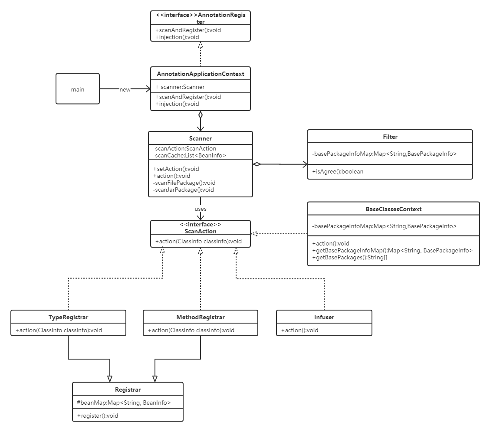
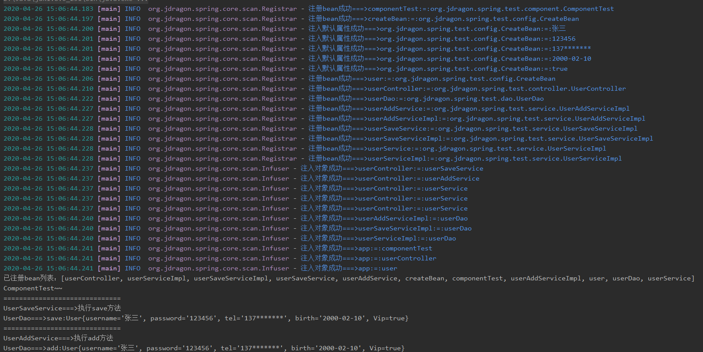

## 利用注解反射尝试写类似spring的注册与自动装配

### 一、类图



### 二、角色交代

- AnnotationApplicationContext：放置各种工作者与已注册组件beanMap的容器。
- Scanner：扫描者，对传入的basePackage开始往下扫描注解，并在第一次扫描的时候进行缓存scanCache。
- Registrar：注册登记者：在扫描者扫出有关注册注解时(bean或Component)，由注册登记者来处理解释这些注解。
- Infuser：注入者：在扫描者扫出有关注入注解时(Autowired)，由注入者来将组件注入到相应的注解下。

### 三、行为步骤

#### 1、扫描

在AnnotationApplicationContext容器中，Scanner在第一次扫描时对basePackage以下的文件进行递归扫描，
并将生成beanInfo存入beanInfo缓存scanCache链表中，以后扫描都将扫描这个链表。只负责扫描。

在Scanner扫描过程中，会使用ScanAction接口的action方法

#### 2、组件注册

实现ScanAction接口，在扫描过程中调用，对组件生成key与object，放入beanMap中，具体处理细节请查看代码

#### 3、组件注入

实现ScanAction接口，在扫描过程中调用，对autowired下的注解进行注入，具体处理细节请查看代码。

### 四、注解功能

现有注解：


| 注解                             | 描述                                                         | 作用范围 |
| :------------------------------- | :----------------------------------------------------------- | -------- |
| @Component                       | 通用组件，在扫描时加入容器                                   | 类       |
| @Repository,@Service,@Controller | 属于@Component，声明一个类是组件，在扫描时加入容器           | 类       |
| @Configuration                   | 属于@Component，通常与@Bean搭配使用，在该注解下的@Bean才能注册到容器中，默认使用单例模式注入 | 类       |
| @Bean                            | 声明一个方法是bean工厂，在启动时，其注解value值为beanName，返回值为bean，加入容器中，若beanName值为空，则使用方法名，默认使用单例模式注入 | 方法     |
| @Autowired                       | 标注在字段上，自动从容器从获取与字段类型名字相同的bean，并将他赋给这个字段。 | 字段     |
| @Qualifier                       | 与@Autowired搭配使用，在使用@Qualifier时，@Autowired中会使用@Qualifier中的值来代替获取字段类型名。 | 字段     |
| @Value                           | 给组件中的字段赋予默认值，只能赋予有String.class类型的构造的值 | 字段     |
| @Scope                           | 与@Bean或@Component搭配使用，设置组件的注入模式：单例或原型。默认是使用单例模式 | 类，方法 |


注意：

- 在使用@Bean对类的方法返回值进行注册时，该类本身也要交给容器管理。
- 在使用@Autowired对类的非静态变量注入时，该类本身也要交给容器管理。
- 若字段上没有@Autowired注解，@Qualifier是无效的。
- @Value缺陷在于，这个被赋予默认值的字段类必须要有一个String.class类型的构造器。
- @Configuration，@Repository，@Service，@Controller，@Component是一样的，只是用作区分不同作用的组件罢了。


使用方法：

正确设置注解后，在主方法中启动容器

```java
import org.jdragon.spring.core.AnnotationApplicationContext;

public static void main(String[] args) {
        AnnotationApplicationContext ctx = new AnnotationApplicationContext(App.class);
}
```


### 五、测试截图

