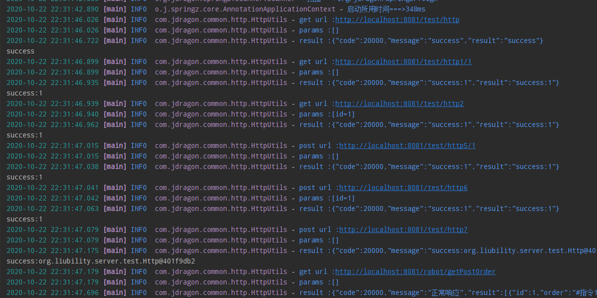

## 利用注解反射尝试写类似spring的注册与自动装配

### 一、类图


### 二、角色交代

- AnnotationApplicationContext：放置各种工作者与已注册组件beanMap的容器。
- Scanner：扫描者，对传入的basePackage开始往下扫描注解，并在第一次扫描的时候进行缓存scanCache。
- Registrar：注册登记者：在扫描者扫出有关注册注解时(bean或Component)，由注册登记者来处理解释这些注解。
- Infuser：注入者：在扫描者扫出有关注入注解时(Autowired)，由注入者来将组件注入到相应的注解下。
- Filter：过滤者，对@Filter中的条件进行判断这个包是否需要扫描。
- BaseClassesContext：经过@Filter过滤后需要扫描的类的信息的存放容器。

### 三、行为步骤

一共对进行三次包扫描


#### 1、扫描

属于第二次扫描，在AnnotationApplicationContext容器中，Scanner对basePackages下的文件进行递归扫描，在Scanner扫描过程中，会使用ScanAction接口的action。

#### 2、扫描前的Filter初始化BaseClassesContext

属于第一次包扫描，进行全盘的扫描@ComponentScans或ComponentScan，并对其@Filter注解进行分析，分析出所有的需扫包后生成BaseClassesContext实例存放这些需扫包信息。然后将basePackages传入Filter构造实例。

#### 3、组件注册

属于第二次包扫描，对BaseClassesContext中已获取的需扫包信息进行扫描，Registara实现ScanAction接口，在扫描过程中调用，对组件生成key与object，放入beanMap中，具体处理细节请查看代码

#### 4、组件注入

属于第三次包扫描，对BaseClassesContext中已获取的需扫包信息进行扫描，Infuser实现ScanAction接口，在扫描过程中调用，对autowired下的注解进行注入，具体处理细节请查看代码。

### 四、注解功能

现有注解：


| 注解                             | 描述                                                         | 作用范围                                             |
| :------------------------------- | :----------------------------------------------------------- | ---------------------------------------------------- |
| @Component                       | 通用组件，在扫描时加入容器                                   | 类                                                   |
| @Repository,@Service,@Controller | 属于@Component，声明一个类是组件，在扫描时加入容器           | 类                                                   |
| @Configuration                   | 属于@Component，通常与@Bean搭配使用，在该注解下的@Bean才能注册到容器中，默认使用单例模式注入 | 类                                                   |
| @Bean                            | 声明一个方法是bean工厂，在启动时，其注解value值为beanName，返回值为bean，加入容器中，若beanName值为空，则使用方法名，默认使用单例模式注入 | 方法                                                 |
| @AutowiredZ                       | 可标注在字段或set方法上，自动从容器从获取与字段类型名字相同的bean，若字段使用：将bean赋给这个字段。若方法使用，则将bean赋给setXXX中XXX首字母小写后的字段名的字段。 | 字段，方法                                           |
| @Qualifier                       | 与@Autowired搭配使用，在使用@Qualifier时，@Autowired中会使用@Qualifier中的值来代替获取字段类型名。 | 字段，方法                                           |
| @Value                           | 给组件中的字段赋予默认值，只能赋予有String.class类型的构造的值 | 字段                                                 |
| @Scope                           | 与@Bean或@Component搭配使用，设置组件的注入模式：单例或原型。默认是使用单例模式 | 类，方法                                             |
| @Resource                        | 与@Autowired使用相似，但匹配的不是字段类型而是字段名称。与@Autowired搭配@Qualifier使用时无异 | 类，方法                                             |
| @SpringzScan                   | 标注要扫什么包，并且根据什么条件进行包含与剔除               | 类                                                   |
| @SpringzScans                  | 可以重复使用@ComponentScan                                   | 类                                                   |
| @Filter                          | 在@ComponentScan内使用，指定包含或剔除的条件                 | @ComponentScan的includeFilters或excludeFilters属性内 |
| @Import                          | 根据import的类的全类名，添加一个单例的类实例Bean             | 类                                                   |


使用方法：

正确设置注解后，在主方法中启动容器，App.class意味着从App.java这个文件目录下开始扫包

```java
@SpringzMain
@SpringzScan(basePackageClasses = App.class)
public class App {
public static void main(String[] args) {
        AnnotationApplicationContext ctx = new AnnotationApplicationContext(App.class);
}
```


注意：

- 当没有@SpringzScan时，创建AnnotationApplicationContext默认会到参数class的路径开始扫描包。
- 在使用@Bean对类的方法返回值进行注册时，该类本身也要交给容器管理。
- 在使用@AutowiredZ与@Resource对类的非静态变量注入时，该类本身也要交给容器管理。
- 若字段上没有@AutowiredZ注解时，@Qualifier是无效的。
- @Value缺陷在于，这个被赋予默认值的字段类必须要有一个String.class类型的构造器。
- @Configuration，@Repository，@Service，@Controller，@Component是一样的，只是用作区分不同作用的组件罢了。


### 五、示例测试截图

测试示例代码代码已在springz-test模块，拉取后可自行测试。


### 六、如何拓展Bean注册

在本项目中，springz-feign为拓展core实现的远程调用接口依赖。

只要实现ScanAction接口，和拥有一个`public Class(Map<String, BeanInfo> beanMap)`构造器，在本项目中这个构造器大多以继承`Registrar`后调用其构造方法实现

补充一个注解 `Enable***SpringZ` 上再使用`SpringzScan(basePackage=“拓展项所在包”)`

下例为springz-Feign的拓展补充注解，注在启动类上即为启动被拓展功能

```java
@Target(ElementType.TYPE)
@Retention(RetentionPolicy.RUNTIME)
@SpringzScan(basePackage = "org.jdragon.springz.feign")
public @interface EnableFeignSpringZ {
    
}
```
### 七、Feign使用示例

```java
@ZFeign(baseUrl = "http://localhost:8081", basePath = "/test",depth = "result")
public interface HttpTest {
    //get http://localhost:8081/test/http
    @GetMapping("/http")
    public String http();

    //get http://localhost:8081/test/http1/{id}
    @GetMapping("/http1/{id}")
    public String http1(@PathVariable("id") int id);

    //get http://localhost:8081/test/http2?id={id}
    @GetMapping("/http2")
    public String http2(@RequestParam("id") int id);

    //带body的get http://localhost:8081/test/http3
    @GetMapping("/http3")
    public String http3(@RequestBody int id);

    //post http://localhost:8081/test/http4
    @PostMapping("/http4")
    public String http4();

    //post http://localhost:8081/test/http5/{id}
    @PostMapping("/http5/{id}")
    public String http5(@PathVariable("id") int id);

    //post http://localhost:8081/test/http6?id={id}
    @PostMapping("/http6")
    public String http6(@RequestParam("id") int id);

    //带body的post http://localhost:8081/test/http7
    @PostMapping("/http7")
    public String http7(@RequestBody Http test);
}

```

```java
@SpringzMain
@SpringzScan
@EnableFeignSpringZ //启动springz-feign
public class App {

    private static final Logger logger = LoggerFactory.getLogger(App.class);

    private static final AnnotationApplicationContext ctx = new AnnotationApplicationContext(App.class);
    
    @AutowiredZ
    private static HttpTest httpTest;

    public static void main(String[] args){
        httpTest.http();

        httpTest.http1(1);

        httpTest.http2(1);

        httpTest.http4();

        httpTest.http5(1);

        httpTest.http6(1);

        httpTest.http7(new Http(1));

        ctx.close();
    }
}
```





### 从maven开始使用


```xml
<!--jdragon的仓库-->
<repositories>
    <repository>
        <id>jdragon-nexus</id>
        <url>http://jdragon.club:12345/repository/jdragon-repo/</url>
    </repository>
</repositories>
```

如果你仅仅想使用spring-core中的ioc容器，那么请使用springz-core

```xml
<!--springz core依赖-->
<dependency>
    <groupId>org.jdragon.springz</groupId>
    <artifactId>springz-core</artifactId>
    <version>1.0</version> 
</dependency>
```

如果你想使用core+feign，那么请使用springz-feign

```xml
<!--springz feign依赖 自带core无需再导入-->
<dependency>
    <groupId>org.jdragon.springz</groupId>
    <artifactId>springz-feign</artifactId>
    <version>1.0</version> 
</dependency>
```


